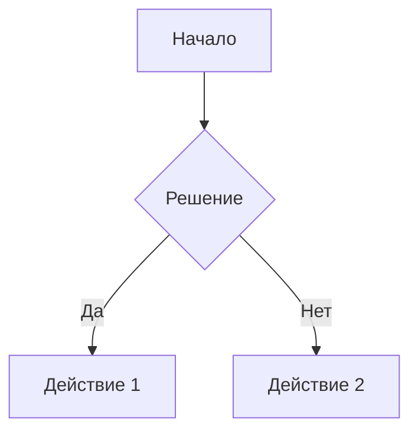

Это моя первая статья написанная в Markdown

```javascript
function hello() {
    console.log("Hello, world!");
}
```

---

title: "Полное руководство по Markdown"
author: "Ваше Имя"
date: "2023-11-15"
tags: [markdown, документация, пример]

---

# Заголовок 1 уровня

## Заголовок 2 уровня

### Заголовок 3 уровня

#### Заголовок 4 уровня

##### Заголовок 5 уровня

###### Заголовок 6 уровня

---

## Текстовое форматирование

- **Жирный текст** или **альтернативный синтаксис**
- _Курсив_ или _альтернативный синтаксис_
- **_Жирный курсив_** или **_альтернативный синтаксис_**
- ~~Зачеркнутый текст~~
- Встроенный `код`: `const example = "text"`

---

## Списки

### Нумерованный список

1. Первый пункт
2. Второй пункт
3. Третий пункт
    1. Вложенный пункт (4 пробела)
    2. Еще один вложенный

### Маркированный список

- Пункт 1
- Пункт 2
    - Вложенный пункт (2 пробела)
    - Еще вложенный
        - Глубже (4 пробела)

### Список задач

- [x] Сделать документацию
- [ ] Протестировать примеры
- [ ] Отправить на проверку

---

## Ссылки и изображения

[Официальная документация](https://www.markdownguide.org "Подсказка при наведении")

---

## Таблицы

| Заголовок 1 | Заголовок 2 | Заголовок 3 |
| ----------- | ----------- | ----------- |
| Ячейка 1    | Ячейка 2    | Ячейка 3    |
| Ячейка 4    | Ячейка 5    | Ячейка 6    |

С выравниванием:

| По левому краю | По центру | По правому краю |
| :------------- | :-------: | --------------: |
| данные         |  данные   |          данные |

---

## Цитаты

> Это основная цитата. Она может содержать
> несколько строк и даже **форматирование**.

> > Вложенная цитата

---

## Код

Встроенный код: `npm install package-name`

Блок кода с указанием языка:

```javascript
function helloWorld() {
    console.log("Hello, world!");
    return true;
}
```

```python
def greet():
    print("Hello, Python!")
    return True
```

---

## Горизонтальные линии

Разделители (используйте любой вариант):

---

---

---

---

## Дополнительные элементы

### Сноски

Текст со сноской[^note].

[^note]: Текст пояснения к сноске.

### Определения

Термин 1
: Определение первого термина

Термин 2
: Определение второго термина

### Встроенный HTML

<details>
<summary>Спойлер (HTML)</summary>
Это скрытый текст, который можно развернуть
</details>

---

## Mermaid-диаграммы (в поддерживаемых редакторах)



# Паттерн Singleton (Одиночка)

Паттерн Singleton гарантирует, что у класса есть только один экземпляр, и предоставляет глобальную точку доступа к этому экземпляру.

## Классическая реализация (по книге "Банды четырех")

```javascript
class Singleton {
  private static instance: Singleton;

  // Закрываем конструктор для предотвращения создания через new
  private constructor() {}

  // Метод для получения экземпляра
  public static getInstance(): Singleton {
    if (!Singleton.instance) {
      Singleton.instance = new Singleton();
    }
    return Singleton.instance;
  }

  // Пример метода
  public someMethod(): void {
    console.log("Метод экземпляра Singleton");
  }
}

// Использование
const instance1 = Singleton.getInstance();
const instance2 = Singleton.getInstance();

console.log(instance1 === instance2); // true - это один и тот же объект
```
